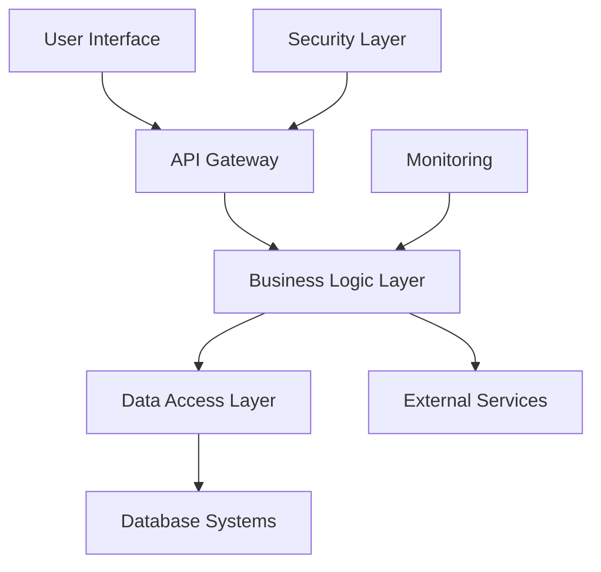
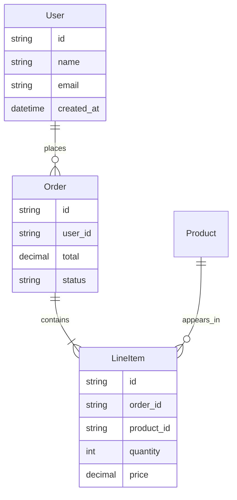

# Technical Approach and Delivery Plan

## Executive Summary

[This living document outlines our technical approach, architecture decisions, and delivery methodology. It evolves as we learn more about the requirements and constraints.]

---

## Architecture Overview

### System Architecture
**High-Level Design**
[Description of the overall system architecture, including major components and their relationships]



### Technology Stack
**Frontend**
- **Framework**: [React/Angular/Vue/etc.]
- **UI Library**: [Material-UI/Ant Design/etc.]
- **State Management**: [Redux/Vuex/etc.]
- **Build Tools**: [Webpack/Vite/etc.]

**Backend**
- **Language/Framework**: [Node.js/Python/Java/etc.]
- **API Design**: [REST/GraphQL/etc.]
- **Authentication**: [OAuth 2.0/JWT/etc.]
- **Database**: [PostgreSQL/MongoDB/etc.]

**Infrastructure**
- **Cloud Provider**: [AWS/Azure/GCP/etc.]
- **Containerization**: [Docker/Kubernetes/etc.]
- **CI/CD**: [Jenkins/GitHub Actions/etc.]
- **Monitoring**: [Prometheus/DataDog/etc.]

---

## Design Principles

### Core Principles
1. **Simplicity**: Favor simple solutions that are easy to understand and maintain
2. **Scalability**: Design for current needs while enabling future growth
3. **Security**: Security-first approach with defense in depth
4. **Performance**: Optimize for user experience and system efficiency
5. **Reliability**: Build resilient systems with proper error handling
6. **Maintainability**: Write clean, documented code for long-term sustainability

### Architectural Decisions
| Decision | Rationale | Alternatives Considered | Impact |
|----------|-----------|-------------------------|--------|
| **[Decision 1]** | [Why we made this choice] | [Alternative 1, Alternative 2] | [Impact on project] |
| **[Decision 2]** | [Why we made this choice] | [Alternative 1, Alternative 2] | [Impact on project] |

---

## Detailed Design

### Component Architecture
**[Component 1]**
- **Purpose**: [What this component does]
- **Responsibilities**: [Key responsibilities]
- **Interfaces**: [How it communicates with other components]
- **Technology**: [Specific technologies used]

**[Component 2]**
- **Purpose**: [What this component does]
- **Responsibilities**: [Key responsibilities]
- **Interfaces**: [How it communicates with other components]
- **Technology**: [Specific technologies used]

### Data Model
**Core Entities**


**Data Flow**
[Description of how data moves through the system, including transformation and validation steps]

### API Design
**Core Endpoints**
| Endpoint | Method | Description | Authentication |
|----------|--------|-------------|----------------|
| `/api/v1/users` | GET | Retrieve user list | Bearer Token |
| `/api/v1/users/{id}` | GET | Retrieve specific user | Bearer Token |
| `/api/v1/orders` | POST | Create new order | Bearer Token |

**Data Formats**
**Request Example**
```json
{
  "user_id": "12345",
  "items": [
    {
      "product_id": "prod_001",
      "quantity": 2
    }
  ]
}
```

**Response Example**
```json
{
  "order_id": "order_123",
  "status": "created",
  "total": 99.99,
  "created_at": "2025-11-07T10:00:00Z"
}
```

---

## Implementation Strategy

### Development Methodology
**Agile Approach**
- **Sprint Duration**: 2 weeks
- **Ceremonies**: Sprint planning, daily standups, sprint review, retrospective
- **Roles**: Product owner, scrum master, development team
- **Artifacts**: Product backlog, sprint backlog, increment

**Sprint Planning**
- **Sprint Goal**: [Overall objective for the sprint]
- **Capacity Planning**: [Team availability and velocity]
- **Story Selection**: [How we choose stories for each sprint]

### Phased Implementation
**Phase 1: Foundation** ([Duration])
- **Sprint 1-2**: Infrastructure setup and CI/CD pipeline
- **Sprint 3-4**: Core data models and basic API structure
- **Sprint 5-6**: Authentication and security framework

**Phase 2: Core Features** ([Duration])
- **Sprint 7-8**: Primary user workflows
- **Sprint 9-10**: Integration with external systems
- **Sprint 11-12**: Business logic implementation

**Phase 3: Enhancement** ([Duration])
- **Sprint 13-14**: Performance optimization
- **Sprint 15-16**: Advanced features and reporting
- **Sprint 17-18**: Testing and deployment preparation

### Risk Mitigation Strategy
**Technical Risks**
- **[Risk 1]**: [Mitigation approach and contingency plan]
- **[Risk 2]**: [Mitigation approach and contingency plan]

**Schedule Risks**
- **[Risk 1]**: [Mitigation approach and contingency plan]
- **[Risk 2]**: [Mitigation approach and contingency plan]

---

## Development Standards

### Code Quality
**Coding Standards**
- **Language Guidelines**: [Specific language standards]
- **Naming Conventions**: [Variable, function, class naming]
- **Documentation Requirements**: [Code documentation standards]
- **Code Review Process**: [Review workflow and criteria]

**Testing Strategy**
- **Unit Testing**: [Framework and coverage requirements]
- **Integration Testing**: [How we test component interactions]
- **End-to-End Testing**: [User workflow testing approach]
- **Performance Testing**: [Load and stress testing plan]

### Security Standards
**Secure Development**
- **Input Validation**: [How we validate and sanitize inputs]
- **Authentication**: [Authentication implementation standards]
- **Authorization**: [Access control implementation]
- **Data Protection**: [Encryption and data handling standards]

**Security Testing**
- **Static Analysis**: [Code security scanning tools]
- **Dynamic Analysis**: [Runtime security testing]
- **Penetration Testing**: [Security assessment approach]

---

## Infrastructure and Operations

### Deployment Architecture
**Environments**
| Environment | Purpose | Configuration | Access |
|-------------|---------|---------------|--------|
| Development | Development and testing | [Config details] | [Access level] |
| Staging | Pre-production validation | [Config details] | [Access level] |
| Production | Live system | [Config details] | [Access level] |

**Deployment Process**
1. **Code Commit**: Developer commits to feature branch
2. **Automated Testing**: CI pipeline runs automated tests
3. **Code Review**: Peer review and approval
4. **Merge**: Code merged to main branch
5. **Build**: Application build and packaging
6. **Deploy**: Automated deployment to staging
7. **Validation**: Staging environment validation
8. **Production Deploy**: Deploy to production with rollback capability

### Monitoring and Observability
**Monitoring Strategy**
- **Application Metrics**: [Key performance indicators]
- **Infrastructure Metrics**: [Server and resource monitoring]
- **Business Metrics**: [User behavior and business KPIs]
- **Alerting**: [Alert thresholds and notification channels]

**Logging Strategy**
- **Log Levels**: [Debug, info, warn, error criteria]
- **Log Aggregation**: [How logs are collected and stored]
- **Log Analysis**: [Tools and processes for log analysis]
- **Retention**: [Log retention policies]

---

## Integration Strategy

### External Integrations
**[Integration 1]**
- **Purpose**: [Why this integration is needed]
- **Protocol**: [API, file transfer, database, etc.]
- **Authentication**: [How we authenticate with the external system]
- **Data Mapping**: [How data is transformed between systems]
- **Error Handling**: [How we handle integration failures]

**[Integration 2]**
- **Purpose**: [Why this integration is needed]
- **Protocol**: [API, file transfer, database, etc.]
- **Authentication**: [How we authenticate with the external system]
- **Data Mapping**: [How data is transformed between systems]
- **Error Handling**: [How we handle integration failures]

### Data Migration
**Migration Strategy**
- **Data Assessment**: [How we analyze existing data]
- **Data Cleansing**: [Data quality improvement process]
- **Migration Approach**: [Big bang vs. phased migration]
- **Validation**: [How we validate migrated data]
- **Rollback Plan**: [How we handle migration failures]

---

## Quality Assurance

### Testing Approach
**Test Pyramid**
```
    E2E Tests (10%)
   ─────────────────
  Integration Tests (20%)
 ─────────────────────────
Unit Tests (70%)
```

**Test Types**
- **Unit Tests**: [What we test at unit level]
- **Integration Tests**: [What we test at integration level]
- **System Tests**: [What we test at system level]
- **User Acceptance Tests**: [How users validate the system]

### Quality Gates
**Definition of Done**
- ✅ Code implemented and reviewed
- ✅ Unit tests written and passing
- ✅ Integration tests passing
- ✅ Documentation updated
- ✅ Security review completed
- ✅ Performance criteria met

---

## Change Management

### Change Process
**Request Types**
- **Feature Requests**: [How we handle new feature requests]
- **Bug Fixes**: [How we prioritize and fix bugs]
- **Technical Changes**: [How we handle architectural changes]
- **Emergency Changes**: [How we handle urgent production issues]

**Impact Assessment**
- **Scope Impact**: [How changes affect project scope]
- **Timeline Impact**: [How changes affect delivery schedule]
- **Budget Impact**: [How changes affect project budget]
- **Risk Impact**: [How changes affect project risk]

---

## Current Status and Next Steps

### Current Progress
**Completed**
- ✅ [Completed item 1]
- ✅ [Completed item 2]
- ✅ [Completed item 3]

**In Progress**
- 🔄 [In progress item 1] - [Status] - [ETA]
- 🔄 [In progress item 2] - [Status] - [ETA]

**Upcoming**
- 📋 [Upcoming item 1] - [Start date] - [Duration]
- 📋 [Upcoming item 2] - [Start date] - [Duration]

### Immediate Next Steps
1. **[Next Step 1]**: [Owner] - [Due date] - [Details]
2. **[Next Step 2]**: [Owner] - [Due date] - [Details]
3. **[Next Step 3]**: [Owner] - [Due date] - [Details]

### Decisions Needed
- **[Decision 1]**: [What needs to be decided] - [Who decides] - [Deadline]
- **[Decision 2]**: [What needs to be decided] - [Who decides] - [Deadline]

---

## Risks and Issues

### Current Risks
| Risk | Status | Impact | Mitigation | Owner |
|------|--------|--------|------------|-------|
| [Risk description] | [Active/Monitoring/Closed] | [High/Med/Low] | [Mitigation strategy] | [Name] |
| [Risk description] | [Active/Monitoring/Closed] | [High/Med/Low] | [Mitigation strategy] | [Name] |

### Current Issues
| Issue | Status | Priority | Resolution Plan | Owner |
|-------|--------|----------|-----------------|-------|
| [Issue description] | [Open/In Progress/Closed] | [High/Med/Low] | [How we'll fix it] | [Name] |
| [Issue description] | [Open/In Progress/Closed] | [High/Med/Low] | [How we'll fix it] | [Name] |

---

## Performance Considerations

### Performance Targets
- **Response Time**: [Specific targets for different operations]
- **Throughput**: [Expected transaction volumes]
- **Concurrent Users**: [Expected user capacity]
- **Availability**: [Uptime targets and SLAs]

### Optimization Strategies
- **Database Optimization**: [Query optimization, indexing, etc.]
- **Caching Strategy**: [What we cache and how]
- **Load Balancing**: [How we distribute load]
- **Content Delivery**: [CDN usage and static asset optimization]

---

## Security Considerations

### Threat Model
**Identified Threats**
- **[Threat 1]**: [Description and impact]
- **[Threat 2]**: [Description and impact]
- **[Threat 3]**: [Description and impact]

**Security Controls**
- **Preventive Controls**: [How we prevent security incidents]
- **Detective Controls**: [How we detect security issues]
- **Corrective Controls**: [How we respond to security incidents]

### Compliance Requirements
- **[Compliance 1]**: [Requirements and implementation approach]
- **[Compliance 2]**: [Requirements and implementation approach]

---

## Appendices

### Appendix A: Technical Specifications
- **[Specification 1]**: [Detailed technical requirements]
- **[Specification 2]**: [Detailed technical requirements]

### Appendix B: Environment Configuration
- **Development Environment**: [Setup instructions]
- **Staging Environment**: [Configuration details]
- **Production Environment**: [Configuration details]

### Appendix C: API Documentation
- **Authentication**: [How to authenticate with APIs]
- **Error Codes**: [Standard error responses]
- **Rate Limiting**: [API usage limits]

---

## Review History

| Version | Date | Changes | Reviewer | Status |
|---------|------|---------|----------|--------|
| 1.0 | 2025-11-07 | Initial version | [Name] | Draft |
| 1.1 | [Date] | [Changes made] | [Name] | [Status] |

---

## Related Documents

- **Project Charter**: [Link to charter.md]
- **Project Understanding**: [Link to understanding.md]
- **Project Backlog**: [Link to project_backlog.md]
- **Technical Specifications**: [Link to tech/ directory]

---

**Document Version**: 1.0  
**Last Updated**: 2025-11-07  
**Next Review**: [Date]  
**Review Frequency**: Weekly or as needed
